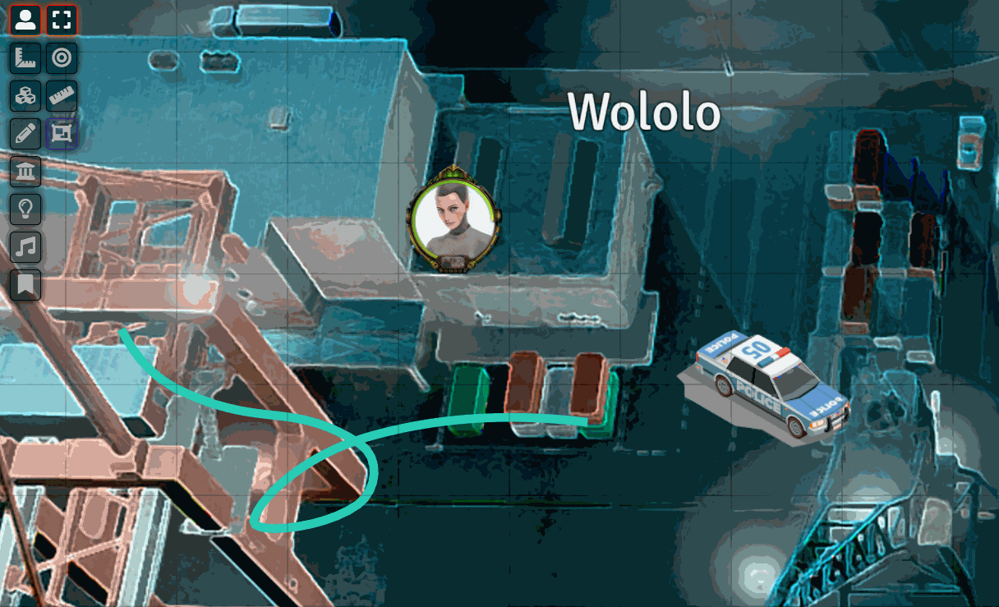

# Super Select for FoundryVTT
Adds a control toggle that allows selecting tokens, tiles and drawings at the same time.

## Notes
* There is a configuration that allows having Super Select mode on by default
* Tokens have priority on top of drawings and tiles
* Objects of different types may not be selected together simultaneously (yet?)
* It is recommended to use Foundry VTT's setting to release on left-click
* Supports DF Hotkey library, with default Shift+S
* The code is ugly, but it is lightweight, fast and self-contained

## Please say thanks if you enjoy this!
I am Doing it as a hobby. Feedback more than welcome.

@JeansenVaars

## Example
