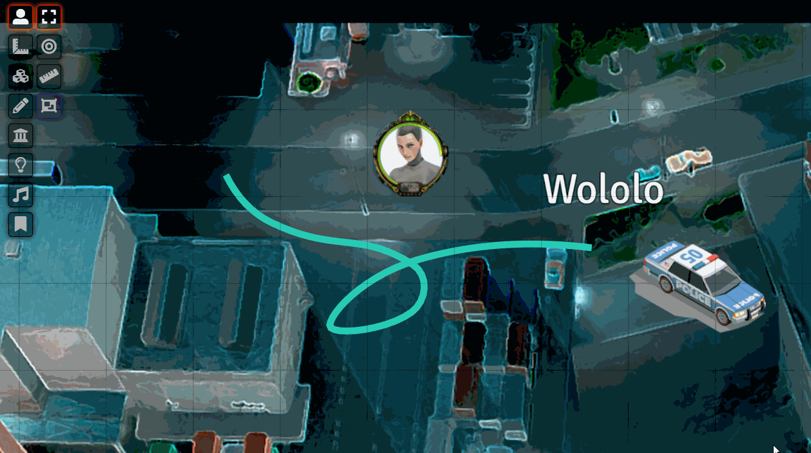

# Super Select for FoundryVTT
This module adds a control toggle that allows selecting objects form the canvas.
When activated, tokens, tiles, and drawings can be selected and worked on regardless of current layer.

## Code Notes
* Objects of different types may not be moved together (yet)
* The code is ugly, but it is lightweight and self-contained.

## Please say thanks if you enjoy this!
I am Doing it as a hobby. Feedback more than welcome.

@JeansenVaars

## Example
